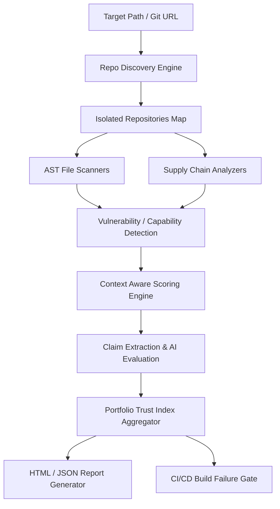

# 🛡️ SkillGuard OSS

> **"Trust but Verify for AI Agent Skills, MCP Servers, and Plugins."**

[](https://github.com/CapedCrusader77/skillguard-oss/actions)
[](https://pypi.org/project/skillguard-oss)
[](LICENSE)
[](https://github.com/CapedCrusader77/skillguard-oss)
[](https://github.com/CapedCrusader77/skillguard-oss)

SkillGuard scans AI agent plugins, MCP (Model Context Protocol) servers, and custom agent skills before installation. It identifies security vulnerabilities, dangerous behaviors, and permission mismatches via AST static analysis and comprehensive supply chain checks.

The ultimate long-term goal of SkillGuard is to become the **"VirusTotal for AI Agent Tools."**

---

## 📖 Table of Contents
1. [Overview](#-overview)
2. [Features](#-features)
3. [Architecture](#-architecture)
4. [Installation](#-installation)
5. [Usage](#-usage)
6. [Benchmark Mode](#-benchmark-mode)
7. [GitHub Action Usage](#-github-action-usage)
8. [Trust Scoring & Deductions](#-trust-scoring--deductions)
9. [AI Claim-vs-Behavior Analysis](#-ai-claim-vs-behavior-analysis)
10. [Roadmap](#-roadmap)
11. [Contributing](#-contributing)
12. [License](#-license)

---

## 🔍 Overview

Artificial intelligence agents rely on plugins and tools (like MCP servers) to interact with the environment. However, running untrusted agent extensions poses a high threat of:
* Arbitrary Command Execution
* Silent Data Exfiltration
* Accessing/Manipulating Local Databases and filesystems
* Credential Harvesting

SkillGuard is a DevSecOps static analysis tool that parses AST representation of code and configuration files, computes a trust score index, and flags dangerous agent capabilities.

---

## ✨ Features

- **AST-Based Source Code Scanning**: Parses Python, JavaScript, TypeScript, and Dart source files recursively to track imports, aliases, and dangerous API calls.
- **Repository Discovery Engine**: Automatically walks directories, groups files by language, detects git boundaries, and isolates multi-project monorepos.
- **Supply Chain Security Analyzers**:
  - **Dependency Analyzer**: Scans requirements manifests and package lockfiles for typosquatting (e.g. `requestss`), duplicate dependencies, and excessive system permissions.
  - **Dockerfile Analyzer**: Flags root execution, unsafe file permissions (`chmod 777`), remote script execution, and unpinned dependencies during container builds.
  - **GitHub Actions Analyzer**: Scans workflow files for remote scripts downloads, actions unpinned to Git commit SHAs, and secrets exposure in environment declarations.
  - **Secret Analyzer**: Searches the codebase recursively for exposed API keys (OpenAI, AWS, Google API keys), JWT/Bearer tokens, and hardcoded variables.
  - **Network Destination Analyzer**: Automatically extracts outbound domains, hostnames, and IPs referenced in request commands.
- **AI Claim-vs-Behavior Analyzer**: Uses LLMs to evaluate if the observed code capabilities align with the developer's claimed purpose (e.g. a "Calculator" plugin should not request network/filesystem access).
- **HTML Dashboards**: Generates interactive styled reports (`report.html`) complete with circular trust gauges and filterable findings.
- **JSON Integration Reports**: Outputs a machine-readable `report.json` with trust scores and categorized findings for CI/CD gates.

---

## 🏗️ Architecture

SkillGuard maps codebases to isolated logical repositories and evaluates security in pipeline:



---

## 🚀 Installation

SkillGuard requires **Python 3.12+**.

### Via PyPI
```bash
pip install skillguard-oss
```

### From Source
```bash
git clone https://github.com/CapedCrusader77/skillguard-oss.git
cd skillguard-oss
pip install -e .
```

---

## 💻 Usage

Scan a repository, directory, or individual file using:

```bash
skillguard scan <path_or_url> [OPTIONS]
```

### Options

* `--full`: Runs the complete suite including code AST scanners and all supply chain analyzers.
* `--html`: Generates an interactive, styled HTML dashboard report in `report.html`.
* `--json`: Generates a structured JSON summary report in `report.json`.
* `--ai`: Runs AI-powered Claim vs Behavior analysis.
* `-o`, `--output <path>`: Specifies custom path for the generated JSON report.

### Examples

**Scan a python directory (AST scan only):**
```bash
skillguard scan ./my-mcp-server
```

**Run a full supply chain and secrets audit on a repository, outputting HTML and JSON reports:**
```bash
skillguard scan ./my-plugin-repo --full --html --json
```

**Scan a remote GitHub repository:**
```bash
skillguard scan https://github.com/modelcontextprotocol/servers --html
```

---

## 📊 Benchmark Mode

The `benchmark` command allows DevSecOps teams to evaluate and compare multiple repositories at once, generating a consolidated `benchmark_report.html` dashboard.

```bash
skillguard benchmark repos.txt [OPTIONS]
```

### `repos.txt` format
Provide a list of repository clone URLs (one per line):
```text
https://github.com/langchain-ai/langchain
https://github.com/modelcontextprotocol/servers
https://github.com/crewAIInc/crewAI
```

### Options
* `-o`, `--output <path>`: Path to output the HTML dashboard comparison.
* `--full`: Run full supply chain audits on each repository.

---

## 🤖 GitHub Action Usage

Integrate SkillGuard directly into your CI/CD pipelines to audit pull requests. Add the following file to `.github/workflows/skillguard.yml`:

```yaml
name: SkillGuard Security Gate

on:
  pull_request:
    branches: [ main ]

jobs:
  scan:
    name: Audit Agent Skills
    runs-on: ubuntu-latest
    steps:
      - name: Checkout Code
        uses: actions/checkout@v4

      - name: Run SkillGuard Scan
        uses: CapedCrusader77/skillguard-oss@main
        with:
          trust_threshold: 85
          fail_on_critical: true
          report_format: both
```

### Inputs
* `trust_threshold`: Minimum acceptable trust score (0-100) before failing the build. Default: `85`.
* `fail_on_critical`: Fail the build if any `CRITICAL` findings are detected. Default: `true`.
* `report_format`: Choose `json`, `html`, or `both`. Default: `both`.

### Outputs
* `trust_score`: Calculated average trust score.
* `risk_score`: Scored risk metric.
* `report_path`: Path to `report.json`.

---

## 🛡️ Trust Scoring & Deductions

Trust Scores start at 100 for each of the 5 categories. Deductions are subtracted based on the severity of the findings:

* 🔴 **CRITICAL** finding: **-25** points
* 🟠 **HIGH** finding: **-15** points
* 🟡 **MEDIUM** finding: **-10** points
* 🟢 **LOW** finding: **-5** points

The final overall **Trust Score** is the average of these 5 category scores.

---

## 🧠 AI Claim-vs-Behavior Analysis

When the `--ai` flag is enabled, SkillGuard parses the codebase's developer documentation (README, manifests, claims) and compares it with the extracted permission footprints.

If a developer claims their plugin is a simple calculator, but AST scanning detects `socket.connect` and `fs.writeFile`, the AI engine flags the mismatch, computes the Trust Score deduction, and outputs an assessment outlining the anomaly.

---

## 🛣️ Roadmap

- [x] Multi-language AST scanning (Python, JS, TS, Dart)
- [x] Reusable GitHub Action with PR comments
- [x] PyPI packaging and distribution
- [x] Benchmark command for multi-repo scans
- [ ] Integration with SARIF format for GitHub Security Alerts
- [ ] Static taint analysis for data leak detection
- [ ] Sandbox runtime execution monitoring

---

## 🤝 Contributing

Contributions are welcome! Please feel free to open pull requests or submit issues. 

1. Fork the Project.
2. Create your Feature Branch (`git checkout -b feature/AmazingFeature`).
3. Commit your Changes (`git commit -m 'Add some AmazingFeature'`).
4. Push to the Branch (`git push origin feature/AmazingFeature`).
5. Open a Pull Request.

---

## 📄 License

Distributed under the MIT License. See `LICENSE` for more information.
