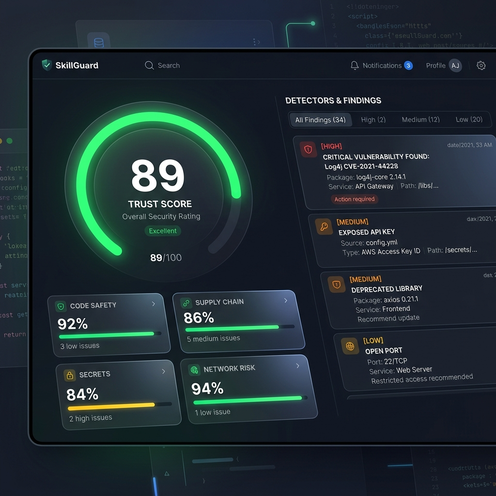
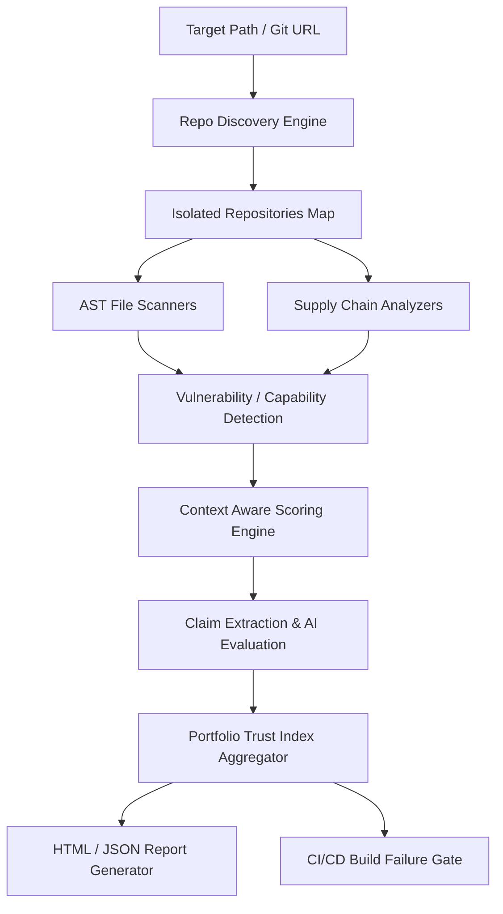

# 🛡️ SkillGuard OSS

SkillGuard OSS is an AI agent supply-chain security scanner that analyzes MCP servers, plugins, agent tools, workflows, dependencies, and source code before execution.

Think of it as **"VirusTotal for AI Agents."**

---

## 🚀 Quick Start

```bash
pip install skillguard-oss

skillguard scan https://github.com/modelcontextprotocol/servers --html
```

Example Output:

```text
Trust Score: 89

Risk Level: LOW

Permission Footprint:
✓ Network Access
✓ Environment Access

Warnings:
* Unpinned GitHub Actions
* Unexpected Filesystem Access
```

---

## 📊 Dashboard Preview



---

## 📖 Table of Contents
1. [Why SkillGuard?](#-why-skillguard)
2. [Overview](#-overview)
3. [Features](#-features)
4. [Architecture](#-architecture)
5. [Installation](#-installation)
6. [Usage](#-usage)
7. [Benchmark Mode](#-benchmark-mode)
8. [GitHub Action Usage](#-github-action-usage)
9. [Trust Scoring & Deductions](#-trust-scoring--deductions)
10. [AI Claim-vs-Behavior Analysis](#-ai-claim-vs-behavior-analysis)
11. [Claim-vs-Runtime Verification](#-claim-vs-runtime-verification)
12. [Roadmap](#-roadmap)
13. [Contributing](#-contributing)
14. [License](#-license)

---

## ❓ Why SkillGuard?

Traditional security scanners focus on source code vulnerabilities.

SkillGuard focuses on AI agent trust.

It answers questions such as:
* Does this MCP server access files unexpectedly?
* Does this plugin execute shell commands?
* Does the observed behavior match the claimed purpose?
* Does the project contain supply-chain risks?
* Should I trust this AI tool before running it?

SkillGuard combines static analysis, supply-chain auditing, trust scoring, and AI-powered behavior assessment into a single workflow.

---

## 🔍 Overview

Artificial intelligence agents rely on plugins and tools (like MCP servers) to interact with the environment. However, running untrusted agent extensions poses a high threat of:
* Arbitrary Command Execution
* Silent Data Exfiltration
* Accessing/Manipulating Local Databases and filesystems
* Credential Harvesting

SkillGuard is a DevSecOps static analysis tool that parses AST representation of code and configuration files, computes a trust score index, and flags dangerous agent capabilities.

---

## ✨ Features

- **AST-Based Source Code Scanning**: Parses Python, JavaScript, TypeScript, and Dart source files recursively to track imports, aliases, and dangerous API calls.
- **Repository Discovery Engine**: Automatically walks directories, groups files by language, detects git boundaries, and isolates multi-project monorepos.
- **Supply Chain Security Analyzers**:
  - **Dependency Analyzer**: Scans requirements manifests and package lockfiles for typosquatting (e.g. `requestss`), duplicate dependencies, and excessive system permissions.
  - **Dockerfile Analyzer**: Flags root execution, unsafe file permissions (`chmod 777`), remote script execution, and unpinned dependencies during container builds.
  - **GitHub Actions Analyzer**: Scans workflow files for remote scripts downloads, actions unpinned to Git commit SHAs, and secrets exposure in environment declarations.
  - **Secret Analyzer**: Searches the codebase recursively for exposed API keys (OpenAI, AWS, Google API keys), JWT/Bearer tokens, and hardcoded variables.
  - **Network Destination Analyzer**: Automatically extracts outbound domains, hostnames, and IPs referenced in request commands.
- **AI Claim-vs-Behavior Analyzer**: Uses LLMs to evaluate if the observed code capabilities align with the developer's claimed purpose (e.g. a "Calculator" plugin should not request network/filesystem access).
- **HTML Dashboards**: Generates interactive styled reports (`report.html`) complete with circular trust gauges and filterable findings.
- **JSON Integration Reports**: Outputs a machine-readable `report.json` with trust scores and categorized findings for CI/CD gates.

---

## 🏗️ Architecture

SkillGuard maps codebases to isolated logical repositories and evaluates security in pipeline:


```mermaid
graph TD
    A[Target Path / Git URL] --> B[Repo Discovery Engine]
    B --> C[Isolated Repositories Map]
    C --> D[AST File Scanners]
    C --> E[Supply Chain Analyzers]
    D --> F[Vulnerability / Capability Detection]
    E --> F
    F --> G[Context Aware Scoring Engine]
    G --> H[Claim Extraction & AI Evaluation]
    H --> I[Portfolio Trust Index Aggregator]
    I --> J[HTML / JSON Report Generator]
    I --> K[CI/CD Build Failure Gate]
```

---

## 🚀 Installation

SkillGuard requires **Python 3.12+**.

### Via PyPI
```bash
pip install skillguard-oss
```

### From Source
```bash
git clone https://github.com/CapedCrusader77/skillguard-oss.git
cd skillguard-oss
pip install -e .
```

---

## 💻 Usage

Scan a repository, directory, or individual file using:

```bash
skillguard scan <path_or_url> [OPTIONS]
```

### Options

* `--full`: Runs the complete suite including code AST scanners and all supply chain analyzers.
* `--html`: Generates an interactive, styled HTML dashboard report in `report.html`.
* `--json`: Generates a structured JSON summary report in `report.json`.
* `--ai`: Runs AI-powered Claim vs Behavior analysis.
* `--verify-runtime`: Runs a Python entrypoint in a Linux bubblewrap + strace sandbox and compares observed resources with extracted claims. Implies `--full` and `--trust`.
* `--runtime-timeout <seconds>`: Bounds the runtime verification invocation (default: 10 seconds).
* `-o`, `--output <path>`: Specifies custom path for the generated JSON report.

### Examples

**Scan a python directory (AST scan only):**
```bash
skillguard scan ./my-mcp-server
```

**Run a full supply chain and secrets audit on a repository, outputting HTML and JSON reports:**
```bash
skillguard scan ./my-plugin-repo --full --html --json
```

**Scan a remote GitHub repository:**
```bash
skillguard scan https://github.com/modelcontextprotocol/servers --html
```

## 🔬 Claim-vs-Runtime Verification

Static analysis can identify what a tool appears capable of, but it cannot
prove what happens during execution. Runtime verification adds a bounded,
opt-in run of a Python entrypoint inside a Linux `bubblewrap` namespace while
`strace` records file, network, and process syscalls. The resulting
`runtime_verification` section is included in JSON reports and contains the
claim profile, runtime profile, discrete mismatch findings, and a weighted
trust delta.

```bash
skillguard scan ./my-mcp-server --verify-runtime --json
```

The verifier fails closed: on systems without Linux, `bwrap`, or `strace`, the
report records `sandbox_unavailable` rather than treating the tool as verified.
Unavailable or incomplete runs set `verification_available` to `false` and do
not receive a verification score or trust delta.
The checked-in 20-repository benchmark was executed with full bubblewrap namespace
isolation and strace syscall capture on Ubuntu Linux CI runners (`verification_available: true`).
Across the benchmarked ecosystem, tools that completed execution (such as
`modelcontextprotocol/quickstart-resources` weather server) were verified clean
(0 mismatches, verification score: 100). Repositories lacking runtime dependencies
were halted fail-closed with single explicit status findings (`dependency_missing`),
and non-Python implementations were cleanly recorded (`could_not_execute`).
The benchmark methodology, per-repo observations, and validation notes are documented in
[BENCHMARK.md](BENCHMARK.md) and [VALIDATION_NOTES.md](VALIDATION_NOTES.md), with the
rationale for every score weight in [SCORING.md](SCORING.md).

---

## 📊 Benchmark Mode

The `benchmark` command allows DevSecOps teams to evaluate and compare multiple repositories at once, generating a consolidated `benchmark_report.html` dashboard.

```bash
skillguard benchmark repos.txt [OPTIONS]
```

### `repos.txt` format
Provide a list of repository clone URLs (one per line):
```text
https://github.com/langchain-ai/langchain
https://github.com/modelcontextprotocol/servers
https://github.com/crewAIInc/crewAI
```

### Options
* `-o`, `--output <path>`: Path to output the HTML dashboard comparison.
* `--full`: Run full supply chain audits on each repository.

For the claim-vs-runtime benchmark, use the included public repository list:

```bash
skillguard benchmark-runtime benchmark_mcp_servers.txt --output benchmark_results.json
```

---

## 🤖 GitHub Action Usage

Integrate SkillGuard directly into your CI/CD pipelines to audit pull requests. Add the following file to `.github/workflows/skillguard.yml`:

```yaml
name: SkillGuard Security Gate

on:
  pull_request:
    branches: [ main ]

jobs:
  scan:
    name: Audit Agent Skills
    runs-on: ubuntu-latest
    steps:
      - name: Checkout Code
        uses: actions/checkout@v4

      - name: Run SkillGuard Scan
        uses: CapedCrusader77/skillguard-oss@main
        with:
          trust_threshold: 85
          fail_on_critical: true
          report_format: both
```

### Inputs
* `trust_threshold`: Minimum acceptable trust score (0-100) before failing the build. Default: `85`.
* `fail_on_critical`: Fail the build if any `CRITICAL` findings are detected. Default: `true`.
* `report_format`: Choose `json`, `html`, or `both`. Default: `both`.

### Outputs
* `trust_score`: Calculated average trust score.
* `risk_score`: Scored risk metric.
* `report_path`: Path to `report.json`.

---

## 🛡️ Trust Scoring & Deductions

Trust Scores start at 100 for each of the 5 categories. Deductions are subtracted based on the severity of findings and project profile capabilities:

* 🔴 **CRITICAL** finding: **-25** points
* 🟠 **HIGH** finding: **-15** points
* ⚠️ **Unexpected Capability** (e.g. undeclared filesystem or network access for the profiled project type): **-15** points

*Note: Medium and Low severity findings are flagged as warning indicators but do not directly deduct points from the category trust scores.*

The final overall **Trust Score** is the average of these 5 category scores.

---

## 🧠 AI Claim-vs-Behavior Analysis

When the `--ai` flag is enabled, SkillGuard parses the codebase's developer documentation (README, manifests, claims) and compares it with the extracted permission footprints.

If a developer claims their plugin is a simple calculator, but AST scanning detects `socket.connect` and `fs.writeFile`, the AI engine flags the mismatch, computes the Trust Score deduction, and outputs an assessment outlining the anomaly.

---

## 🛣️ Roadmap

- [x] Reusable GitHub Action with PR comments
- [ ] Integration with SARIF format for GitHub Security Alerts
- [x] PyPI packaging and distribution
- [x] Multi-language AST scanning (Python, JS, TS, Dart)
- [x] Benchmark command for multi-repo scans
- [ ] Static taint analysis for data leak detection
- [ ] Sandbox runtime execution monitoring

---

## 🤝 Contributing

Contributions are welcome! Please feel free to open pull requests or submit issues. 

1. Fork the Project.
2. Create your Feature Branch (`git checkout -b feature/AmazingFeature`).
3. Commit your Changes (`git commit -m 'Add some AmazingFeature'`).
4. Push to the Branch (`git push origin feature/AmazingFeature`).
5. Open a Pull Request.

---

## 📄 License

Distributed under the MIT License. See `LICENSE` for more information.
