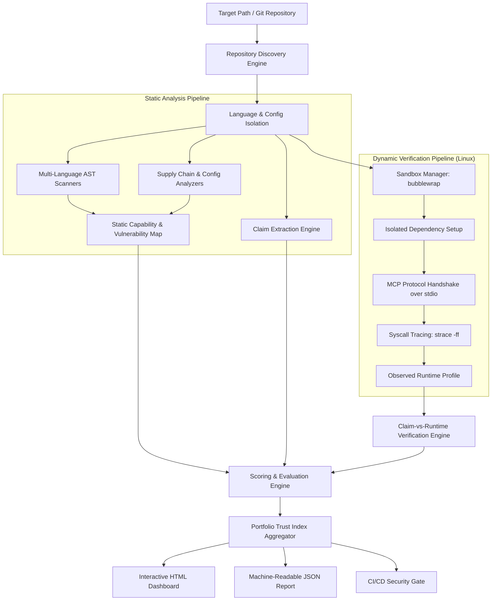

# 🛡️ SkillGuard OSS

[](https://github.com/CapedCrusader77/skillguard-oss/actions/workflows/runtime-regression.yml)
[](https://www.python.org/downloads/)
[](https://opensource.org/licenses/MIT)
[](#-claim-vs-runtime-verification)
[](https://github.com/CapedCrusader77/skillguard-oss/pulls)

**SkillGuard OSS** is an AI agent supply-chain security scanner and dynamic runtime verification engine. It analyzes Model Context Protocol (MCP) servers, agent skills, plugins, workflows, dependencies, and codebases before and during execution.

Think of it as **"VirusTotal for AI Agents."**

---

## 🚀 Quick Start

```bash
# Install SkillGuard
pip install skillguard-oss

# Scan an MCP server or repository (Static Analysis + HTML Report)
skillguard scan https://github.com/modelcontextprotocol/servers --html

# Run with sandboxed dynamic runtime verification (Linux bubblewrap + strace)
skillguard scan ./my-mcp-server --verify-runtime --html --json
```

### Example CLI Output:

```text
============================================================
🛡️  SkillGuard Security & Trust Report
============================================================
Overall Trust Score: 89/100 (LOW RISK)

Runtime Verification:
  Status: COMPLETED
  Sandbox: bubblewrap + strace
  Verification Score: 100/100 (Trust Delta: 0)

Permission Footprint:
  ✓ Network Access (api.weather.gov:443)
  ✓ Environment Access (PATH, LANG)
  - Filesystem Writes: None detected

Static Security Warnings:
  * Unpinned GitHub Actions workflow dependency
============================================================
```

---

## 📊 Dashboard Preview


---

## 📖 Table of Contents
1. [Why SkillGuard?](#-why-skillguard)
2. [Key Capabilities](#-key-capabilities)
3. [Architecture](#-architecture)
4. [Installation](#-installation)
5. [Usage & Commands](#-usage--commands)
6. [Claim-vs-Runtime Verification](#-claim-vs-runtime-verification)
7. [Benchmark Mode](#-benchmark-mode)
8. [GitHub Action CI/CD Gate](#-github-action-cicd-gate)
9. [Trust Scoring System](#-trust-scoring-system)
10. [Roadmap](#-roadmap)
11. [Contributing](#-contributing)
12. [License](#-license)

---

## ❓ Why SkillGuard?

Traditional static application security testing (SAST) tools scan for generic code flaws like SQL injection or memory safety bugs.

**SkillGuard focuses on AI agent trust and intent alignment.**

It answers critical questions before you install or grant permissions to an AI agent extension:
* **Undeclared Capabilities**: Does this "calculator" or "format converter" tool silently open network sockets or read `~/.ssh`?
* **Claim Mismatches**: Does the observed runtime behavior match what the developer claims in manifests and tool descriptions?
* **Supply-Chain Vulnerabilities**: Are there typosquatted packages, unsafe Docker configurations, or unpinned GitHub Actions?
* **Exfiltration Risk**: Does the tool harvest environment keys, API tokens, or local credentials?

SkillGuard combines multi-language static AST scanning, supply-chain auditing, AI claim analysis, and **sandboxed dynamic runtime syscall verification** into a single cohesive pipeline.

---

## ✨ Key Capabilities

- **AST-Based Source Code Scanning**:
  - Recursively parses Python, JavaScript, TypeScript, and Dart ASTs to detect dangerous imports, shell executions, filesystem operations, and network calls.
- **Dynamic Runtime Verification (Bubblewrap + strace)**:
  - Executes entrypoints in isolated Linux namespaces (`bwrap`) with per-thread syscall monitoring (`strace -ff`).
  - Performs sandboxed dependency installation (`pip`) and standard MCP JSON-RPC 2.0 handshake (`initialize`, `notifications/initialized`, `tools/list`) over stdio.
  - Compares observed syscall profiles against declared claims and calculates a weighted trust delta.
  - Fails closed: non-running or missing environments produce explicit status findings rather than false passes.
- **Supply-Chain Security Analyzers**:
  - **Dependency Analyzer**: Detects typosquatting (e.g., `requestss`), duplicate packages, and malicious install scripts.
  - **Dockerfile Analyzer**: Flags root execution, unsafe file permissions (`chmod 777`), remote script execution, and unpinned base images.
  - **GitHub Actions Analyzer**: Audits workflows for unpinned action SHAs, secret leaks, and untrusted script downloads.
  - **Secret Detection Engine**: Scans for exposed OpenAI keys, AWS tokens, Google API keys, JWTs, and private keys.
  - **Network Destination Extractor**: Automatically extracts external domains, IPs, and endpoints called by the tool.
- **AI Claim-vs-Behavior Assessment**:
  - Uses LLMs to evaluate semantic alignment between developer documentation/claims and detected static code capabilities.
- **Reporting & Dashboards**:
  - Interactive HTML dashboard (`report.html`) with visual trust gauges and filterable finding tables.
  - Machine-readable JSON report (`report.json`) tailored for CI/CD gating.
- **Multi-Repo Benchmark Suite**:
  - Built-in runner for evaluating collections of agent skills or MCP servers simultaneously.

---

## 🏗️ Architecture


```mermaid
graph TD
    A[Target Path / Git Repository] --> B[Repository Discovery Engine]
    B --> C[Language & Config Isolation]

    subgraph "Static Analysis Pipeline"
        C --> D[Multi-Language AST Scanners]
        C --> E[Supply Chain & Config Analyzers]
        D --> F[Static Capability & Vulnerability Map]
        E --> F
        C --> G[Claim Extraction Engine]
    end

    subgraph "Dynamic Verification Pipeline (Linux)"
        C --> H[Sandbox Manager: bubblewrap]
        H --> I[Isolated Dependency Setup]
        I --> J[MCP Protocol Handshake over stdio]
        J --> K[Syscall Tracing: strace -ff]
        K --> L[Observed Runtime Profile]
    end

    F --> M[Scoring & Evaluation Engine]
    G --> M
    L --> N[Claim-vs-Runtime Verification Engine]
    N --> M

    M --> O[Portfolio Trust Index Aggregator]
    O --> P[Interactive HTML Dashboard]
    O --> Q[Machine-Readable JSON Report]
    O --> R[CI/CD Security Gate]
```

---

## 🚀 Installation

SkillGuard requires **Python 3.12+**.

### From PyPI
```bash
pip install skillguard-oss
```

### From Source
```bash
git clone https://github.com/CapedCrusader77/skillguard-oss.git
cd skillguard-oss
pip install -e .
```

### Optional Linux Runtime Sandbox Dependencies
To enable dynamic runtime verification (`--verify-runtime`), ensure `bubblewrap` and `strace` are installed on your Linux system:
```bash
# Debian / Ubuntu
sudo apt-get update && sudo apt-get install -y bubblewrap strace
```

---

## 💻 Usage & Commands

### Single Target Scan

```bash
skillguard scan <path_or_url> [OPTIONS]
```

#### Common Options:
* `--full`: Runs complete suite including code AST scanners and all supply-chain analyzers.
* `--html`: Generates an interactive HTML report (`report.html`).
* `--json`: Generates a structured JSON summary (`report.json`).
* `--ai`: Runs AI-powered Claim vs Behavior semantic analysis.
* `--verify-runtime`: Runs Python entrypoints inside Linux `bubblewrap` + `strace` to compare declared claims with observed syscalls.
* `--runtime-timeout <seconds>`: Bounds runtime verification timeout (default: 10s).
* `-o`, `--output <path>`: Specifies custom output path for JSON report.

#### Examples:

**1. Fast static scan of a local directory:**
```bash
skillguard scan ./my-mcp-server
```

**2. Full supply-chain audit with HTML dashboard:**
```bash
skillguard scan ./my-plugin-repo --full --html
```

**3. Sandboxed dynamic runtime verification:**
```bash
skillguard scan ./my-mcp-server --verify-runtime --html --json
```

**4. Scan a remote GitHub repository directly:**
```bash
skillguard scan https://github.com/modelcontextprotocol/servers --html
```

---

## 🔬 Claim-vs-Runtime Verification

Static analysis identifies what code *appears* capable of doing, but dynamic verification proves what happens *during execution*.

When `--verify-runtime` is invoked, SkillGuard:
1. **Installs dependencies** inside an isolated Bubblewrap sandbox namespace.
2. **Executes the server entrypoint** under `strace -ff` capture.
3. **Conducts MCP JSON-RPC 2.0 handshake** over `stdin`/`stdout` (`initialize`, `notifications/initialized`, `tools/list`) to observe tool capabilities.
4. **Parses system calls** into structured file access, network socket, and process execution profiles.
5. **Cross-references runtime activity** against static claims to detect undeclared network connections, unexpected file writes, or credential access.
6. **Computes a weighted trust delta** reflecting the severity of observed discrepancies.

### Fail-Closed Design
If runtime verification cannot proceed (e.g., missing dependencies, non-Linux OS, unsupported runtime), SkillGuard **fails closed**—recording an explicit status finding (`dependency_missing`, `could_not_execute`, `timeout`) rather than falsely passing the tool.

Detailed runtime benchmark data and calibration notes are documented in:
* [BENCHMARK.md](BENCHMARK.md) – 20-repository real runtime benchmark analysis.
* [VALIDATION_NOTES.md](VALIDATION_NOTES.md) – Root-cause calibration and trace parsing audit.
* [SCORING.md](SCORING.md) – Penalty weighting and trust delta rationale.

---

## 📊 Benchmark Mode

Evaluate and compare multiple agent tools across your organization:

### Static Multi-Repo Benchmark
```bash
skillguard benchmark repos.txt --output benchmark_report.html
```

### Dynamic Runtime Benchmark
Run the verified 20-repository MCP benchmark suite:
```bash
skillguard benchmark-runtime benchmark_mcp_servers.txt --output benchmark_results.json
```

---

## 🤖 GitHub Action CI/CD Gate

Audit pull requests automatically before merging new skills or MCP servers. Add `.github/workflows/skillguard.yml`:

```yaml
name: SkillGuard Security Gate

on:
  pull_request:
    branches: [ main ]

jobs:
  scan:
    name: Audit Agent Skills
    runs-on: ubuntu-latest
    steps:
      - name: Checkout Code
        uses: actions/checkout@v4

      - name: Run SkillGuard Scan
        uses: CapedCrusader77/skillguard-oss@main
        with:
          trust_threshold: 85
          fail_on_critical: true
          report_format: both
```

---

## 🛡️ Trust Scoring System

Trust Scores start at **100** across 5 categories: Code Safety, Supply Chain, Secrets, Configuration, and Claim Alignment.

Deductions are applied based on severity:
* 🔴 **CRITICAL** finding: **-25** points
* 🟠 **HIGH** finding: **-15** points
* 🟡 **Unexpected Capability**: **-15** points
* 🔬 **Runtime Verification Mismatch**: Weighted deduction based on resource sensitivity (e.g. credential access = -30, undeclared write = -20).

---

## 🛣️ Roadmap

- [x] Multi-language AST scanning (Python, JS, TS, Dart)
- [x] Supply chain analyzers (Dependencies, Dockerfiles, GitHub Actions, Secrets)
- [x] Interactive HTML dashboards & machine-readable JSON reports
- [x] Reusable GitHub Action for CI/CD security gates
- [x] Dynamic sandbox execution monitoring with Linux Bubblewrap & strace
- [x] MCP JSON-RPC 2.0 handshake integration in runtime harness
- [x] Multi-repo benchmark suite with real runtime observations
- [x] PyPI packaging and distribution
- [ ] Expanded polyglot runtime capture (Node.js / TypeScript MCP servers)
- [ ] Integration with SARIF format for native GitHub Security Alerts
- [ ] Static taint tracking for sensitive data flows

---

## 🤝 Contributing

Contributions are welcome! Please feel free to open pull requests or submit issues.

1. Fork the Project.
2. Create your Feature Branch (`git checkout -b feature/AmazingFeature`).
3. Commit your Changes (`git commit -m 'Add some AmazingFeature'`).
4. Push to the Branch (`git push origin feature/AmazingFeature`).
5. Open a Pull Request.

---

## 📄 License

Distributed under the MIT License. See [LICENSE](LICENSE) for more information.
